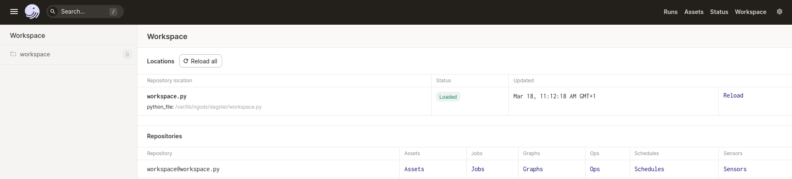
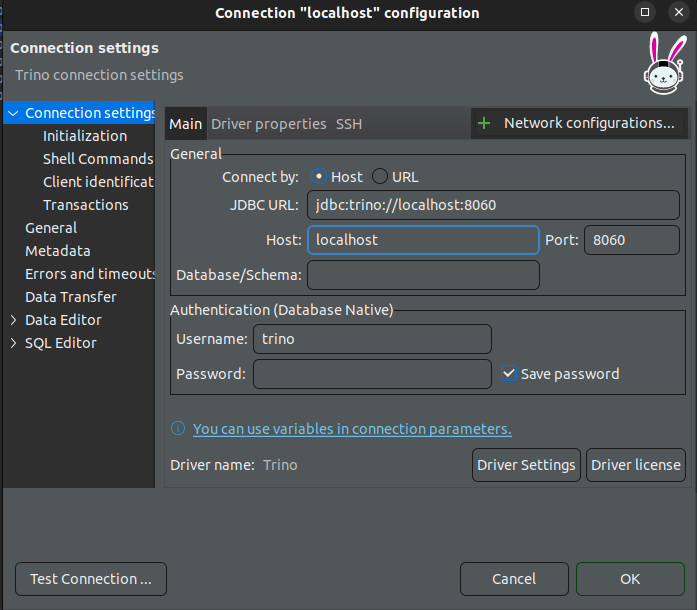
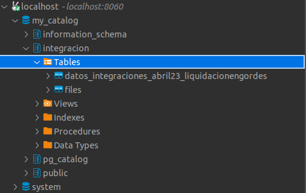

# ngods stock market demo 
This repository contains a stock market analysis demo of the ngods data stack. The demo performs the following steps:

1. Insertar tablas en input_files, de formato excel para efectuar la carga de los datos.
2. Ejecucion de transformaciones en dagit, y su posterior transformacion en datos sql(Trino).
3. Generacion de archivos, launch, para mantener el estado de la base de datos.


The demo is packaged as [docker-compose](https://github.com/docker/compose) script that downloads, installs, and runs all components of the data stack.

## UPDATES
- 2023-02-03: 
    - Upgrade to Apache Iceberg 1.1.0
    - Upgrade to Trino 406
    - Migrated to the new JDBC catalog (removed the heavyweigt Hive Metastore)

# ngods
ngods stands for New Generation Opensource Data Stack. It includes the following components: 

- [Apache Spark](https://spark.apache.org) for data transformation (This has been removed from the demo, but in case we wanted a transformation to iceberg format, we would reemploy it)
- [Apache Iceberg](https://iceberg.apache.org) as a data storage format 
- [Trino](https://trino.io/) for federated data query 
- [Dagster](https://dagster.io/) for data orchestration 
- [Minio](https://min.io) for local S3 storage 

ngods is open-sourced under a [BSD license](https://github.com/zsvoboda/ngods-stocks/blob/main/LICENSE) and it is distributed as a docker-compose script that supports Intel and ARM architectures.

# Running the demo
ngods requires a machine with at least 16GB RAM and Intel or Arm 64 CPU running [Docker](https://www.docker.com/). It requires [docker-compose](https://github.com/docker/compose).

1. Clone the [ngods repo](https://gitlab.com/b5531/data-lake)

```bash
git clone https://gitlab.com/b5531/data-lake
```

2. Start the data stack with the `docker-compose up` command

```bash
cd ngods-stocks

docker-compose up -d
```

As the commands have been purged from extra data, this should take around 2 minutes.

3. Stop the data stack via the `docker-compose down` command

```bash
docker-compose down
```

4. Execute the data workspace from the dagit console in [http://localhost:3070/]

 

5. Download [DBeaver](https://dbeaver.io/download/) SQL tool.

6. Connect to the Postgres database that contains the `integracion` stage data. Use `jdbc:postgresql://localhost:5432/localhost` JDBC URL with username `trino` and without a password.

 



7. Not yet defined (Iceberg conversion)

## ngods directories
Here are few distribution's directories that you may need to customize:

- `conf` configuration of all data stack components
    - `cube` cube.dev schema (semantic model definition)
- `data` main data directory 
    - `minio` root data directory (contains buckets and file data)
    - `spark` Jupyter notebooks
    - `stage` file stage data. Spark can access this directory via `/var/lib/ngods/stage` path. 
- `projects` dbt, Dagster, and DataHub projects
    - `dagster` Dagster orchestration project
    - `dbt` dbt transformations (one project per each medallion stage: `bronze`, `silver`, and `gold`) 

## ngods endpoints
The data stack has the following endpoints

- Spark
    - http://localhost:8888 - Jupyter notebooks 
    - `jdbc:hive2://localhost:10009` JDBC URL (no username / password)
    - localhost:7077 - Spark API endpoint
    - http://localhost:8061 - Spark master node monitoring page 
    - http://localhost:8062 - Spark slave node monitoring page 
    - http://localhost:18080 - Spark history server page 
- Trino
    - `jdbc:trino://localhost:8060` JDBC URL (username `trino` / no password)
- Postgres
    - `jdbc:postgresql://localhost:5432/ngods` JDBC URL (username `ngods` / password `ngods`)
- Dagster
    - http://localhost:3070 - Dagster orchestration UI
- Minio
    - http://localhost:9001 - Minio UI (username `minio` / password `minio123`)

## ngods databases: Spark, Trino, and Postgres
ngods stack includes three database engines: Spark, Trino, and Postgres. Both Spark and Trino have access to Iceberg tables in `warehouse.bronze` and `warehouse.silver` schemas. Trino engine can also access the `analytics.gold` schema in Postgres. Trino can federate queries between the Postgres and Iceberg tables. 

# Docker compose modification
A la hora de ejecutar la aplicacion, lo haremos de la forma normal y esperable para un docker compose, "docker compose up", las principales modificaciones son, la creacion de imagen de aio ahora incluye un requirements, que nos permite interactuar de forma correcta con dagster y python.
Por otra parte la imagen de trino, se ejecuta mediante un dockerfile ya encontrado previamente en el directorio, mas estaba comentada, principalmente se encarga de inicializar correctamente 
el catalogo y las cuestiones minimas definidas en trino/conf/trino
Por ultimo hemos de mencionar la desaparicion de muchas de las funcionalidades como lo son spark o cube por ejemplo puesto que no aportaban a la creacion efectuada, en consecuencia sus imagenes han sido removidas del docker compose, manteniendo las de mc, minio (esta debido a su posible posterior implementacion), trino, dagster y postgres.

# projects/dagster modification
En la carpeta projects/dagster se encuentran los archivos que definen el flujo de trabajo de dagster.
Encontramos ademas carpetas como input_files o processed files orientadas a la gestion de los archivos de input recibidos por parte de las distintas
empresas, por otra parte tenemos launch, donde se generaran archivos de tipo sql con los cuales podremos recrear la base de datos en caso de reiniciar el sistema o una perdida de su estado.

# Trino
Trino es un motor de consulta SQL distribuido que permite ejecutar consultas analíticas interactivas contra datos de cualquier tamaño. Trino es capaz de unir datos de múltiples fuentes, como bases de datos relacionales, sistemas de archivos locales y remotos, y sistemas de almacenamiento en la nube. Trino es un proyecto de código abierto y es compatible con la mayoría de las herramientas de análisis de datos y visualización de datos.

Ahora, trino forma una parte fundamental del sistema presentado, por ello queremos destacar como funciona la generacion de catalogos.

- Esto se lleva a cabo de manera manual en la carpeta (./trino/conf/trino), alli encontramos desde el formato de creacion de los catalogos hasta las propiedas de nodos o la jvm empleada. Para mas informacion mirar (./trino/conf/trino/Dockerfile)


## workspace.py
Contiene las distintas funciones y operaciones requeridas para la ejercucion de los distintos flujos de trabajo, como por ejemplo la operacion de descarga de archivos, la operacion de procesamiento de archivos, la operacion de carga de archivos, entre otras.
### iterate_lib
itera a traves de los archivos de input_files y ejecuta la operacion de descarga de archivos.
Esto ultimo se efectua mediante un diccionario, cuyas entradas son: rows, columns, name_file, t_Create todas ellas explicadas enviadas a init que se encargara de gestionar los datos para la creacion de las tablas.
### read_files_op
- Funcion encargada de la descarga del archivo.

- Itera a traves de las tuplas de una tabla y genera una serie de listas, lista, la cual contiene los valores para la creacion de la tabla, rows, las filas de la tabla y columns, las columnas de la tabla.
### identify_string_type
identica de que valor se trata el string insertado, para determinar que formato tienen los valores a insertar, por ahora incluye, timestamp, bigint, double y varchar, esto se lleva a cabo con la libreria regex de python (expresiones regulares).

### init
Funcion encargada de ligar las anteriores operaciones, con el objetivo de establecer la base de datos, sigue una estructura: Catalogo-schema-tablas.
- Verifica la existencia de un archivo de persistencia en launch, si no existe, salta directamente a la lectura de excels en input_files. En caso contrario ejecuta todas las queries encontradas en los respectivos archivos dentro de launch.
- Lectura de diccionarios de tipo:
    - t_Create: Guarda el tipo de valor de la columna asi como su nombre, para la creacion de la tabla.
    - Rows, columns y name_file, que como sus nombres indican, son para la posterior generacion de tabla en la base de datos con unas ciertas, filas, columnas y nombre de archivo.
    - Por ultimo cabe destacar que todas las queries ejecutadas en esta funcion son guardadas en una serie de listas de queries, las cuales se persisten (persist_query_list) en archivos de tipo sql en launch.