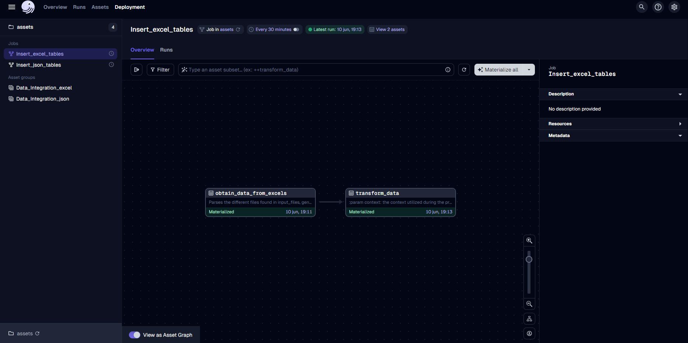
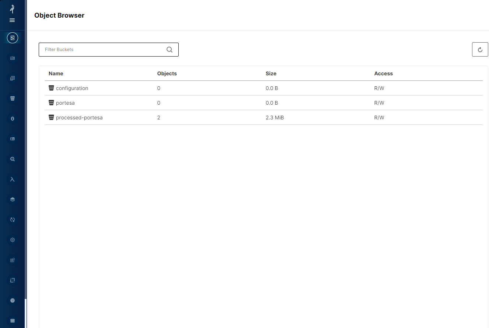

# ngods stock market demo 
This repository contains a stock market analysis demo of the ngods data stack. The demo performs the following steps:

1. Insertar tablas en input_files, de formato excel para efectuar la carga de los datos.
2. Ejecucion de transformaciones en dagit, y su posterior transformacion en datos sql(Trino).
3. Generacion de archivos, launch, para mantener el estado de la base de datos.


La demo está empaquetada como un script [docker-compose](https://github.com/docker/compose) que descarga, instala y ejecuta todos los componentes de la pila de datos.

# ngods
ngods son las siglas de New Generation Opensource Data Stack. Incluye los siguientes componentes: 

- [Apache Spark](https://spark.apache.org) para la transformación de datos (Se ha eliminado de la demo, pero en caso de que quisiéramos una transformación a formato iceberg, volveríamos a emplearlo)
- [Apache Iceberg](https://iceberg.apache.org) como formato de almacenamiento de datos 
- Trino](https://trino.io/) para la consulta federada de datos 
- Dagster://dagster.io/) para la orquestación de datos 
- Minio](https://min.io) para el almacenamiento local en S3 

ngods es de código abierto bajo una [licencia BSD](https://github.com/zsvoboda/ngods-stocks/blob/main/LICENSE) y se distribuye como un script docker-compose que soporta arquitecturas Intel y ARM.

# Ejecución de la demo
ngods requiere una máquina con al menos 16GB RAM y CPU Intel o Arm 64 ejecutando [Docker](https://www.docker.com/). Requiere [docker-compose](https://github.com/docker/compose).

1. Clone el [Datalake repo](https://gitlab.com/b5531/data-lake)

```bash
git clone https://gitlab.com/b5531/data-lake
```

2. Inicia la pila de datos con el comando `docker-compose up`.

```bash
cd datalake

docker-compose up -d
```

Como los comandos han sido purgados de datos extra, esto debería tomar alrededor de 2-4 minutos, cuando se ejecuta debido a Trino
actualizaciones, los comandos pueden no estar disponibles hasta las 17:00 hora española.

3. Detenga la pila de datos mediante el comando `docker-compose down

```bash
docker-compose down
```

4. Ejecute el espacio de trabajo de datos desde la consola dagit en [http://localhost:3070/]

 

5. Descargue [Datagrip](https://www.jetbrains.com/es-es/datagrip/download/#section=windows) o cualquier herramienta SQL.

6. Conéctese a la base de datos Postgres que contiene los datos de la etapa `integracion`. Utilice `jdbc:postgresql://localhost:5432/localhost` JDBC URL con el nombre de usuario `trino` y sin contraseña.

 


7. Acceder a [Minio](http://localhost:9001/browser) (donde manejaremos la entrada de datos para la conversión posterior):  


## directorios ngods
Aquí hay algunos directorios de la distribución que puede que tenga que personalizar:

- `conf` configuración de todos los componentes de la pila de datos    - `cube` cube.dev schema (definición del modelo semántico)
- `data` directorio principal de datos 
    - `minio` directorio raíz de datos (contiene buckets y datos de ficheros)
- `projects` proyectos dbt, Dagster y DataHub
    - `dagster` Proyecto de orquestación de Dagster
    - `Trino` capa de aceleración Sql
## ngods endpoints
La pila de datos tiene los siguientes puntos finales

    - `jdbc:trino://localhost:8060` JDBC URL (username `trino` / no password)
- Postgres
    - `jdbc:postgresql://localhost:5432/ngods` JDBC URL (username `ngods` / password `ngods`)
- Dagster
    - http://localhost:3000 - Dagster orchestration UI
- Minio
    - http://localhost:9001 - Minio UI (username `minio` / password `minio123`)
# Docker compose modification
A la hora de ejecutar la aplicacion, lo haremos de la forma normal y esperable para un docker compose, "docker compose up", las principales modificaciones son, la creacion de imagen de aio ahora incluye un requirements, que nos permite interactuar de forma correcta con dagster y python.
Por otra parte la imagen de trino, se ejecuta mediante un dockerfile ya encontrado previamente en el directorio, mas estaba comentada, principalmente se encarga de inicializar correctamente 
el catalogo y las cuestiones minimas definidas en trino/conf/trino
Por ultimo hemos de mencionar la desaparicion de muchas de las funcionalidades como lo son spark o cube por ejemplo puesto que no aportaban a la creacion efectuada, en consecuencia sus imagenes han sido removidas del docker compose, manteniendo las de mc, minio (esta debido a su posible posterior implementacion), trino, dagster y postgres.

# projects/dagster modification
En la carpeta projects/dagster se encuentran los archivos que definen el flujo de trabajo de dagster.
Encontramos ademas carpetas como input_files o processed files orientadas a la gestion de los archivos de input 
recibidos por parte de las distintas
empresas, por otra parte tenemos launch, donde se generaran archivos de tipo sql con los cuales podremos recrear la base
de datos en caso de reiniciar el sistema o una perdida de su estado.

# Trino
Trino es un motor de consulta SQL distribuido que permite ejecutar consultas analíticas interactivas contra datos de
cualquier tamaño. Trino es capaz de unir datos de múltiples fuentes, como bases de datos relacionales, sistemas de
archivos locales y remotos, y sistemas de almacenamiento en la nube. Trino es un proyecto de código abierto y es
compatible con la mayoría de las herramientas de análisis de datos y visualización de datos.

Ahora, trino forma una parte fundamental del sistema presentado, por ello queremos destacar como funciona la
generacion de catalogos.

- Esto se lleva a cabo de manera manual en la carpeta (./trino/conf/trino), alli encontramos desde el formato 
de creacion de los catalogos hasta las propiedas de nodos o la jvm empleada. Para mas informacion mirar (./trino/conf/trino/Dockerfile)

## assets.py
Contiene los principales assets o unidades de trabajo que se emplean a la hora de realizar un job (o tarea), además de 
todas las funciones auxiliares requeridas para desempeñar su funcionalidad.
## __init__.py
Contiene las conección con trino, así como la definición de las tareas y recursos
### obtain_data_from_excels
Este asset itera a traves de los archivos contenidos en los distintos buckets de minio y ejecuta la operacion de descarga de archivos.
Esto ultimo se efectua mediante un diccionario, cuyas entradas son: rows, columns, name_file, bucket_name todas ellas 
explicadas enviadas a transform_data que se encargara de gestionar los datos para la creacion de las tablas.
### Transform_data
Asset encargado de ligar las anteriores operaciones, con el objetivo de establecer la base de datos, sigue una
estructura: Catalogo-schema-tablas.
- Lectura de diccionarios de tipo:
    - name: Guarda el nombre del objeto minIO al que estamos accediendo.
    - Rows, columns: Guardan las columnas y filas de la tabla.
    - bucket_name: Guarda el nombre del bucket al que hace referencia la tabla.
de datos con unas ciertas, filas, columnas y nombre de archivo.
### obtain_data_from_json
Este asset repite la logica aplicada en el definido anteriormente, basicamente itera a traves de las distintas localizaciones
en un bucket procesa los datos para mandarlos a transform_json_data
### tranform_json_data
De la misma manera que lo hace transform data, envía la información contenida en los archivos json a través de trino

